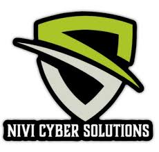
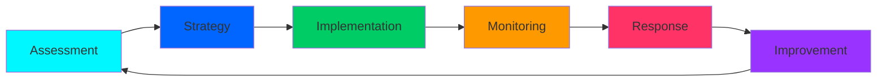

### Securing Your Digital Future

---

## 🌟 About Us

**Nivi Cyber Solutions** is a technology-driven cybersecurity firm dedicated to protecting businesses from evolving digital threats. We specialize in delivering **reliable, scalable, and proactive security solutions** that ensure your organization's data integrity, privacy, and business continuity.

In today's interconnected world, cyber risks are more sophisticated than ever. Our expert team combines cutting-edge technology with proven security strategies to keep your digital assets safe.

### 🎯 Our Mission

*To empower organizations with robust and reliable cybersecurity solutions that ensure data integrity, privacy, and business continuity.*

### 🌍 Our Vision

*To become a trusted global cybersecurity partner known for innovation, reliability, and excellence in digital security.*

---

## 🔐 Our Services

<table>
<tr>
<td width="50%">

### 🔍 Vulnerability Assessment & Penetration Testing (VAPT)
Comprehensive security testing to identify and eliminate vulnerabilities before attackers can exploit them.

### 🌐 Network Security & Monitoring
24/7 network monitoring and advanced protection mechanisms to detect and prevent unauthorized access.

### 💻 Web & Application Security
Safeguard your web applications and APIs from common vulnerabilities and sophisticated attacks.

</td>
<td width="50%">

### 📊 Risk Assessment & Compliance
Ensure your organization meets industry standards and regulatory requirements while minimizing risk.

### 🚨 Incident Response & Threat Management
Rapid response to security incidents with comprehensive threat analysis and mitigation strategies.

### 💡 Cybersecurity Consulting
Expert guidance on security architecture, policies, and best practices tailored to your business needs.

</td>
</tr>
</table>

---

## ⚡ Why Choose Nivi Cyber Solutions?

| 🎯 **Tailored Solutions** | 🔍 **Proactive Defense** | 👨‍💻 **Expert Team** | 🚀 **Latest Technology** |
|:---:|:---:|:---:|:---:|
| Customized security strategies for businesses of all sizes | Advanced threat detection and prevention mechanisms | Skilled cybersecurity professionals with proven expertise | Commitment to cutting-edge tools and evolving standards |

---

## 🛠️ Our Technology Stack

---

## 📈 Our Approach

---

## 🏆 Key Features

🔒 **Advanced Encryption & Protection**
🎯 **Customized Security Solutions**
⚡ **Rapid Incident Response**
📊 **Comprehensive Risk Analysis**
🌐 **Global Security Standards**
💼 **Enterprise-Grade Solutions**

---

## 📞 Get in Touch

Partner with us to secure your digital assets and stay ahead of cyber threats.

**🌐 Website:** [nivicybersolutions.com](https://nivicybersolutions.com)
**📧 Email:** [info@nivicybersolutions.com](mailto:info@nivicybersolutions.com)

### Connect With Us

---

## 🌟 Our Commitment

*At Nivi Cyber Solutions, we don't just protect systems – we protect your business, your reputation, and your future.*

**Secure Today. Confident Tomorrow.**

---

### 💼 Professional Cybersecurity Services | 🛡️ Trusted Protection | 🚀 Innovation Driven

**© 2024 Nivi Cyber Solutions. All Rights Reserved.**

